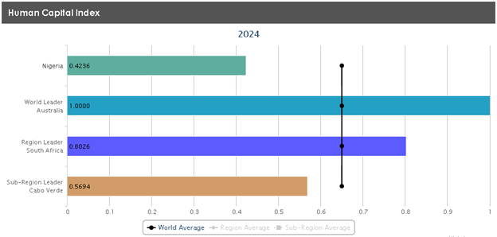
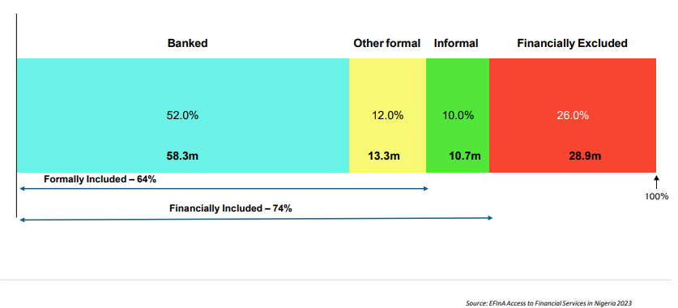

```{r echo=FALSE, message=FALSE, warning=FALSE, output=FALSE}
library(tidyverse)
library(modelsummary)
library(knitr)
library(lubridate)
library(fixest)
library(broom)
library(ggrepel)
library(scales)

nigeria_data <- read_rds("nigeria_data.rds")
gdpMaddison <- read_rds("gdpMaddison.rds")

capdt <- read_csv(
    "Capital Accumulation/NigeriaCapitalFormation.csv")

GFCFperGDP_combined <- read_rds("GFCFperGDP_combined.rds")
```

# Introduction

Nigeria is one of the most prominent countries in Western Africa, known for its rich history in cultural diversity and abundant natural resources. Despite this, the nation’s development is stained with exploitation and corruption by its government. As a former British colony, Nigeria had to grow as an independent nation and rise above its own exploitation of its people; however, its governance has been hindered by persistent political instability. To examine the effect of Nigeria’s institutions, we will look at aspects that constitute the economic growth of a nation: GDP per capita, physical-capital accumulation, human-capital accumulation and its financial inclusion. Through these aspects, we see Nigeria as a nation with potential for growth driven by its abundant human resources and financial innovation but stagnating due to limited action from the government.

## GDP Per Capita

Nigeria through the years has experienced periods of political instability due to civil wars, and poor implementation of economic policy [@marwah2020] that resulted in the nation’s wildly fluctuating GDP per capita. Since 1950 to 2024, Nigeria’s per capita growth has risen 322.5% from US\$1,200 to US\$5070 with an average annual growth rate of 1.97% over the period [@maddison2023] , which is a significant increase but filled extreme downturns. To better understand Nigeria’s economic performance, we will examine the per capita GDP growth adjusted by purchasing power parity (PPP) from the 1950s and view its stagnation over the years as a product of governmental economic mismanagement.

```{r}
ggplot(
    nigeria_data, aes(x = Year, y = `GDP per capita_PPP`)) +
        geom_line(linewidth = 1.1, color='blue') +
        geom_point(stat = "summary", color = "black") +
        geom_point(
            data = subset(nigeria_data, Year %in% c(1968, 1977, 2015)),
            aes(x = Year, y = `GDP per capita_PPP`),
            color = "red",size = 3) +
  scale_x_continuous(
    expand = expansion(mult = c(0, 0.05)),
    breaks = scales::pretty_breaks(n = 15) 
  ) +
  scale_y_continuous(
    labels = scales::comma,                   
    breaks = scales::pretty_breaks(n = 20)    
  ) +
  theme_minimal(base_size = 13) +
  theme(
    panel.grid.minor = element_blank(),
    panel.grid.major.x = element_line(color = "gray90"),
    panel.grid.major.y = element_line(color = "gray85"),
    legend.position = "none",
    plot.title = element_text(face = "bold", size = 15),
    plot.subtitle = element_text(size = 12, color = "gray40"),
    plot.caption = element_text(size = 10, color = "gray50")
  ) +
  labs(
    title = "Nigeria's GDP per capita, 2011 international US$",
    subtitle = "Used Maddison Project Database (2023). Constant 2011 international dollars (PPP-adjusted).",
    x = "Year",
    y = "GDP per capita",
    caption = "Source: Maddison Project Database (2023) | ourworldindata.org"
  )
```

Since 1950, Nigeria’s GDP per capita has experienced several fluctuations with a trough that had a steady climb afterward, and two major peaks followed by declines in 1968, 1977, and 2015 [@maddison2023]. By 1968, GDP per capita had fallen 7.17% from 1950 and 14.8% from her independence year of 1960 marking the nations lowest recorded per capita GDP [@maddison2023]. While after this period, Nigeria saw significant prosperity in the rise that followed it, but the period before was marked by a constant shift in governing bodies due to the independence shift, coups and civil wars that redecided due to humanitarian action from foreign parties by 1968[@mullenbach2016]. By 1977 Nigeria had established itself as an oil exporting nation and had seen a boom in nominal output according to Pinto, 1987, while the GDP per capita since 1968 rose by 99.3% [@maddison2023]. However a downturn followed and despite a stable government, it heavily invested in oil exports without much other fiscal infrastructure and leaving the nation vulnerable to shocks in the oil market such as in 1978 which saw an 8.65% drop in GDP per capita from the previous year [@pinto1987]. Finally, by 2015 per capita GDP had grown an astounding 150.4% since 1977 and 257.2% since 1987 which was the last significant drop. This period saw the most consistent growth in per capita for Nigeria largely due to oil exporting, and a rebasing of the value rather than an impactful improvement in the output per person [@ohuocha2014]. These three points reflect an economy that is too dependent on the volatile market of oil, political uncertainty, and the false appearance of real growth, all are due to government mismanagement.

```{r}
ggplot(
    gdpMaddison, aes(x = Year, y = `GDP per capita_PPP`,color = `Country`)) +
        geom_line(linewidth = 1.1) +
  geom_text_repel(
    data = gdpMaddison %>% group_by(`Country`) %>% filter(Year == max(Year)),
    aes(label = `Country`),
    hjust = 0,
    direction = "y",
    nudge_x = 2,
    size = 5,
    show.legend = FALSE
  ) +
  scale_x_continuous(
    expand = expansion(mult = c(0, 0.05)),
    breaks = scales::pretty_breaks(n = 15) 
  ) +
  scale_y_continuous(
    labels = scales::comma,                   
    breaks = scales::pretty_breaks(n = 20)    
  ) +
  theme_minimal(base_size = 13) +
  theme(
    panel.grid.minor = element_blank(),
    panel.grid.major.x = element_line(color = "gray90"),
    panel.grid.major.y = element_line(color = "gray85"),
    legend.position = "none",
    plot.title = element_text(face = "bold", size = 15),
    plot.subtitle = element_text(size = 12, color = "gray40"),
    plot.caption = element_text(size = 10, color = "gray50")
  ) +
  labs(
    title = "GDP per capita, 2011 international US$",
    subtitle = "Used Maddison Project Database (2023). Constant 2011 international dollars (PPP-adjusted).",
    x = "Year",
    y = "GDP per capita",
    caption = "Source: Maddison Project Database (2023) | ourworldindata.org"
  )
```

Comparing Nigeria to other oil exporting nations brings up two important points; Nigeria is the largest exporter of crude oil in Africa [@eregha2020] and experiences one of the greater declines in per capita GDP[@maddison2023]. Nations such as Algeria, Angola and Libya are oil exporting much like Nigeria and would experience shocks in their markets just as much. Findings from @eregha2020 conclude that other nations per capita growth benefits from oil production while Nigeria does not due poor resource management on the institutions’ part. Algeria, Angola, and Libya have been much more advantageous in their per capita growth since 1950. Algeria grew 520.7% with an average annual growth rate of 2.5%, Angola grew 264.9% with an average annual growth rate of 1.76%, and Libya grew 1957.3% with an average annual growth rate of 4.17% [@maddison2023]. Compared with Nigeria’s 322.5% growth with an average annual growth rate of 1.97%, Angola seems to fair worse but will begin passing Nigeria due to better efforts of resource management and without Nigeria’s dependence on exporting oil without investment in other industries [@eregha2020]. Additionally, Nigeria in comparison suffers in managing policy to benefit its most abundant resource, which in turn negatively influences per capita GDP and the overall living standard. Because of poor government policies, Nigeria can continue to grow its per capita GDP, but it will do so at the mercy of the oil markets until investment in other sectors occur and the populus finds confidence in the government.

We looked at the trend which was affected by global oil prices, shifts in governing bodies that instill uncertainty and re-evaluations of economic financing that give false hope for the growth, while focusing on oil negatively affects the nation’s per capita growth. Nigeria does continue to grow its per capita GDP, but it is too closely tied to the oil market, and this inherently means the standard of living with always depend on it. When a nation solely specialises in a single industry such as oil it forgets its agriculture and manufacturing and must import these to compensate. In Nigeria’s case, these imports will be less accessible when oil negatively impacts per capita GDP, and further decline can occur. Thus, the nations governing body needs better policies and better political infrastructure to avoid the current trajectory.

## Capital Accumulation

The accumulation of capital within a nation can be closely tied to its economic growth using the Solow model [@solow1956]. Thus, we will look at Nigeria’s history of capital accumulation with available data from 2013 to 2023 using gross fixed capital formation (GFCF) in current (2023) US\$ standard as an indicator. View its share with the nation’s gross domestic product (GDP) compared to world averages and look at the trajectory of economic growth with the ideas of the Solow model.

```{r}
ggplot(
    capdt, aes(x = year, y = GFCFcurrentUS)) +
        geom_line(linewidth = 1.1, color='orange') +
        geom_point(stat = "summary", color = "black") +
  scale_x_continuous(
    expand = expansion(mult = c(0, 0.1)),
    breaks = scales::pretty_breaks(n = 10) 
  ) +
  scale_y_continuous(
  labels = label_number(accuracy = 0.1, scale_cut = cut_short_scale()),
  breaks = scales::pretty_breaks(n = 10)
) +
  theme_minimal(base_size = 13) +
  theme(
    panel.grid.minor = element_blank(),
    panel.grid.major.x = element_line(color = "gray90"),
    panel.grid.major.y = element_line(color = "gray85"),
    legend.position = "none",
    plot.title = element_text(face = "bold", size = 15),
    plot.subtitle = element_text(size = 12, color = "gray40"),
    plot.caption = element_text(size = 10, color = "gray50")
  ) +
  labs(
    title = "Nigeria's Gross Fixed Capital Formation (Current US$)",
    subtitle = "Gross Fixed Capital Formation (Current US$) (WEO).",
    x = "Year",
    y = "Gross Fixed Capital Formation",
    caption = "Source: African Development Bank Group (2023) | dataportal.afdb.org"
  )
```

Nigeria’s GFCF between 2013 to 2023 has been fluctuating with a 36.8% increase from US\$72.9B to US\$99.7B, averaging a 3.17% annual change [@afdb2023]. In between this period, there was a peak in 2014, where GFCF rose to US\$85.7B from the previous year as the country saw further production in its oil industry and governmental policies to expand this sector [@afdb2023; @lee2014]. However, by 2018, GFCF had dropped 38% to US\$53.1B, marking a significant trough as reduced investment constrained their productive capacity with a growing population [@afdb2023; @lee2014]. Since then, GFCF has shown a consistent recovery, reaching US\$99.7B by 2023 [@afdb2023].

```{r}
ggplot(
    GFCFperGDP_combined, aes(x = year)) +
  geom_line(aes(y = cap_pct_gdp, color = "World"), linewidth = 1.1) +
  geom_point(aes(y = cap_pct_gdp), size = 2.5, color = "black") +
  geom_line(aes(y = GFCFperGDP, color = "Nigeria"), linewidth = 1.1) +
  geom_point(aes(y = GFCFperGDP),color = "black", size = 2.5) +
  scale_x_continuous(
    expand = expansion(mult = c(0, 0.1)),
    breaks = scales::pretty_breaks(n = 10) 
  ) +
  scale_y_continuous(
    labels = scales::comma,                   
    breaks = scales::pretty_breaks(n = 20)    
  ) +
  theme_minimal(base_size = 13) +
  theme(
    panel.grid.minor = element_blank(),
    panel.grid.major.x = element_line(color = "gray90"),
    panel.grid.major.y = element_line(color = "gray85"),
    plot.title = element_text(face = "bold", size = 15),
    plot.subtitle = element_text(size = 12, color = "gray40"),
    plot.caption = element_text(size = 10, color = "gray50")
  ) +
  labs(
    title = "Nigeria Vs. World Gross Fixed Capital Formation (% GDP)",
    subtitle = "Nigeria's and the World's Gross Fixed Capital Formation as a Percantage of GDP (WEO).",
    x = "Year",
    y = "% of GDP",
    caption = "Source: African Development Bank Group (2023) & World Bank Group | dataportal.afdb.org & data.worldbank.org"
  )
```

At 16.1%, Nigeria’s share of GFCF in GDP is 1.6 times below the world’s average of 26.3%, although significantly greater, the world average increases at 0.39% while Nigeria increases at 6.96% annually [@worldbank_gcf; @afdb2023]. Nigeria’s share of GFCF rose from 13.9% to 27.4%, remaining stagnant until 2018 when it fell to its lowest of 12.6%, while the world rose to 26.5% [@worldbank_gcf; @afdb2023]. Post 2018, Nigeria’s share climbed to its highest peak of 27.4% by 2023, corresponding with the increase in GFCF that surpassed the world average of 26.5% in the same year [@worldbank_gcf; @afdb2023]. The trajectory of Nigeria’s share has seen recent increases at a larger rate, while the global average saw a small decline at lower rates, highlighting the nation’s aim for growth.

According to the Solow model, increases in capital will contribute to increases in productivity, which increases per capita GDP [@solow1956]. In Nigeria’s case, the opposite occurs, where in our period there is an increase in GFCF, but GDP per capita (PPP-adjusted) falls according to @maddison2023. GDP per capita (PPP-adjusted) fell 5.34% while GFCF and its share increased [@afdb2023; @maddison2023]. This prevents us from aligning the country with the model, as per capita GDP (PPPadjusted) does not trend with capital formation. However, Nigeria’s share of GFCF as a percentage of GDP at PPP fell by 8.61% in the available data between 2013 and 2019, which follows the same decline for per capita GDP (PPP-adjusted), and its share [@fred_capform]. Applying the model when comparing GFCF and its share to per capita GDP (PPP-adjusted) yields unapplicable results, but when GFCF’s share is PPP-adjusted, we can find evidence of the model working to predict growth.

In the period from 2013 to 2023, Nigeria’s capital accumulation has significantly expanded, going beyond world averages, indicating an increase in the nation’s physical and monetary capital with the aim of improving its growth. Additionally, increased gross fixed capital formation (GFCF) and its share of GDP have not yielded a similar trend in GDP per capita, but it does follow the share of GFCF as a percentage of GDP at PPP, as predicted in the Solow model.

## Human Capital

Nigeria’s human capital is generally perceived as subpar, with a high population of 237.5 million; there is potential for the nation to benefit in human productivity [@statista2025]. According to the World Bank Group, 2023, Human Capital Index (HCI) is the productivity of an individual by the age of 18, with their education, skills and health. This report examines Nigeria’s current efforts in education and the resulting workforce to assess the nation’s position in managing and developing its human capital.

{fig-align="center"}

Although Nigeria has a population advantage, it underperforms in HCI inputs. By 2024, Nigeria’s HCI reached 0.42, indicating that Nigerians born that year will be 42% productive by age 18, while the world average is 0.65, ranking Nigeria 163rd in the world [@undesa2024]. Additionally, the average years of schooling in Nigeria is 7.2 while the world’s is 8.9, resulting in adult literacy rates of 62% in the country and 87.3% worldwide [@undesa2024]. Nigeria falls behind in cultivating productive individuals compared to the world standards, and this shows that challenges are hindering it from leveraging its human capital.

Education is a key component of HCI, and in 2025, Nigeria will spend 7% of its fiscal budget on education, well below UNESCO’s recommendation of 15% to 20% [@shehu2025]. Due to lower funding in this sector, Nigeria experiences shortages of school supplies and teachers, which prevent students from continuing their schooling and lead to fewer education years [@shehu2025]. However, there are foreign parties such as the World Bank Group that have committed to providing additional funds for Nigeria’s educational sector through the “HOPE-EDU program,” which will donate US\$500 million [@nasir2025]. Although the nation struggles to prioritise adolescent skills, its trajectory for growth could improve if its governance leverages external aid to its advantage.

While Nigeria works to improve its educational investment, its adult literacy rate remains low at 62% due to a poor educational system, with an additional discrepancy of a 20.4% difference between men and women in 2021 [@countryeconomy2024]. This impact is seen in the workforce’s productivity, as the nation faces a surplus of skilled and low-skilled individuals who cannot acquire further skills [@worldbank_gcf]. The major gap between genders highlights the inequality in education, where women face barriers to entering the workforce or improving their skills. With less emphasis on women’s contributions, Nigeria’s growth potential is stagnated by a low-skilled workforce.

Nigeria is a nation that can leverage its large population to increase productivity; however, it faces shortcomings in producing individuals who can contribute to its economic growth. Weakened by a poor education system, many adults lack the necessary skills for efficient work, with women being sidelined. The nation’s low HCI is a culmination of these facts, but with aid and adequate institutions, this can be improved.

## Financial Inclusion

Nigeria’s financial system is a mixture of traditional formal banking and informal nonregulated services, according to the @efina2024a. While there is a variety of options, wealth gaps and gender inequality persist, which leave many financially excluded. According to the @worldbank2023hci, the financial inclusion rate is the percentage of adults who have access to formal or informal financial services. This report examines Nigeria’s financial exclusion and inclusion, how its population fares in this state and how its government addresses the issues.

{fig-align="center" width="809"}

The @efina2024a credits formal bank market competition, increased mobile phone usage and urbanisation for affecting financial access in Nigeria. This has led to 64% of adult Nigerians being formally financially included and 74% with the additional informal means by 2023 [@efina2024a]. This is an increase from 68% in 2020, resulting in fewer people being financially excluded [@efina2024a]. Although only 26% of adult Nigerians are financially excluded, this still accounts for 28.9 million people, mostly in rural areas and dependents such as women [@efina2024a].

As a result, Nigerians, many of whom live in the northern parts of the country, face barriers to financial well-being due to limited accessibility [@efina2024a]. While only 17% of urban residents are excluded, 37% of rural residents are excluded, which was a 2% increase from 35% in 2020, despite the national increase in services [@efina2024a]. Due to increased urbanisation in Nigeria, formal banking services focus their attention on urban cities, ignoring rural areas, and this is evident in the agricultural sector, where small businesses face high barriers to accessing formal start-up funds [@efina2024a]. Due to a lack of formal services, informal services, which include connections and high-interest credit providers, are heavily relied on to provide financial needs [@efina2024a].

To address these issues, the @cbn_finincl implemented the National Financial Inclusion Strategy in 2012, which aimed to reduce the exclusion rate to 20% by 2020. Despite not reaching the target, the exclusion rate is 26% by 2023, a significant decrease from 40% when the policy was first enacted [@efina2024a]. This was achieved through incentivizing competition in the banking sector to bring in a wider range of services, providing infrastructure in telecommunications to increase mobile phone usage for digital financial offerings and introducing services for dependents like women through micro-financing [@cbn_finincl].

Nigeria’s mixed financial sector shows considerable promise, as evidenced by its progress in expanding financial accessibility through policy. There is an incentive for competition in the financial and technology sectors that aid financial inclusion. However, dependents such as women and rural residents continue to be excluded, which shows areas where improvement is needed.

# Conclusion

Through this examination of GDP per capita, physical-capital accumulation, humancapital accumulation, and financial inclusion, Nigeria emerges as a nation that makes attempts to improve its overall economic position. With its growth in GDP per capita resulting from investments in natural resources and the active accumulation of physical capital in the oil market, the nation is on a trajectory to improve its economic growth. Along with its high population, it has human resources that can be leveraged to enhance innovation and technology thanks to active policies that provide individuals with financial access. However, the institutions continue to stagnate growth; policies that mainly benefit the oil sector and lack diversity, insufficient attention paid to the education of the population which has weakened the workforce’s skills, and ignorance of specific demographics such as women and rural residents in accessing training and finance. Together, these findings show that Nigeria’s growth is not only determined by the monetary flow or the resources available to the nation, but also by how it utilises these resources, which are controlled by the governing body

# References

::: {#refs}
:::